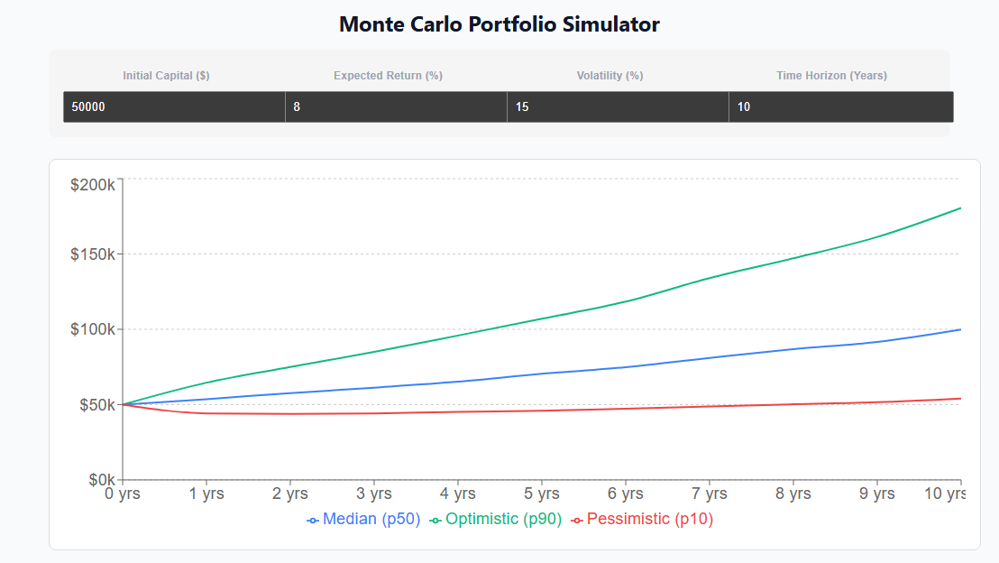

# Portfolio Investment Simulator



A web app for simulating multi-asset portfolio returns using **Geometric Brownian Motion (GBM)** and **Cholesky Decomposition** to handle correlations between assets.

Built with a fast Python/NumPy backend and an interactive React frontend to visualize risk profile percentiles ($P_{10}$, $P_{50}$, $P_{90}$).

## Key Highlights

- **Multi-Asset Simulation:** Simulates correlated price trajectories using Monte Carlo paths.
- **NumPy Vectorization:** Uses tensor operations (`einsum`) to run 100k+ paths in milliseconds without Python loops.
- **Interactive UI:** Real-time percentile chart breakdown ($P_{10}$, $P_{50}$, $P_{90}$) built with React, Vite, and Recharts.
- **Tested Engine:** Includes `pytest` integration test coverage verifying Monte Carlo mean convergence against the theoretical GBM expected value ($E[S_T] = S_0 e^{r T}$).

## Performance Benchmark

Benchmark for **100,000 Monte Carlo paths** over 252 trading days:

| Engine Implementation     | Execution Time | Speedup   |
| :------------------------ | :------------- | :-------- |
| Pure Python (`for` loops) | ~12.40s        | 1.0x      |
| **NumPy Vectorized**      | **~0.12s**     | **~100x** |

## Math & Implementation Notes

### 1. Geometric Brownian Motion

Discrete price steps calculated via the exact solution to the SDE:

$$S_{t+\Delta t} = S_t \cdot \exp\left(\left(\mu - \frac{1}{2}\sigma^2\right)\Delta t + \sigma \sqrt{\Delta t} \, Z_t\right)$$

where $Z_t \sim \mathcal{N}(0, 1)$.

### 2. Asset Correlation

Cross-asset correlation is modeled by decomposing the covariance matrix $\mathbf{\Sigma} = \mathbf{L}\mathbf{L}^T$ via Cholesky decomposition and multiplying lower triangular matrix $\mathbf{L}$ with uncorrelated normal shocks $\mathbf{Z}$:

$$\mathbf{Z}_{\text{correlated}} = \mathbf{L} \mathbf{Z}$$

## Project Structure

```text
├── backend/
│   ├── benchmark.py          # Benchmark comparing Python loops vs NumPy
│   ├── test_simulation.py    # Tests for convergence & seed consistency
│   ├── main.py               # FastAPI application
│   ├── monte_carlo.py        # Core GBM & Cholesky simulation engine
│   └── requirements.txt
└── frontend/
    ├── src/
    │   ├── components/       # Charts & UI inputs
    │   ├── math/             # Client-side Monte Carlo fallback
    │   ├── App.tsx
    │   └── main.tsx
    ├── package.json
    └── vite.config.ts
```

## Quickstart

### Backend

```bash
cd backend
pip install -r requirements.txt
pytest test_simulation.py
python main.py
```

### Frontend

```bash
cd frontend
npm install
npm run dev
```
